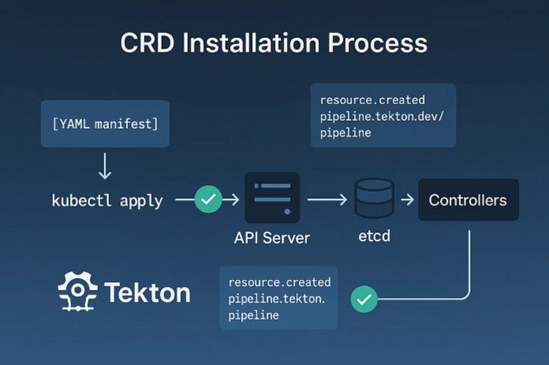
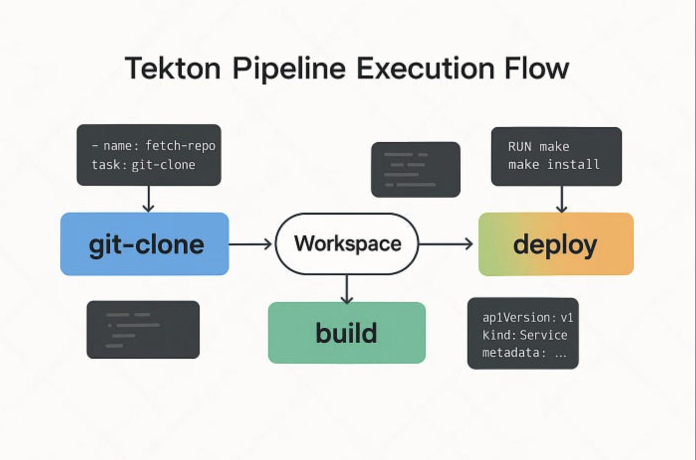
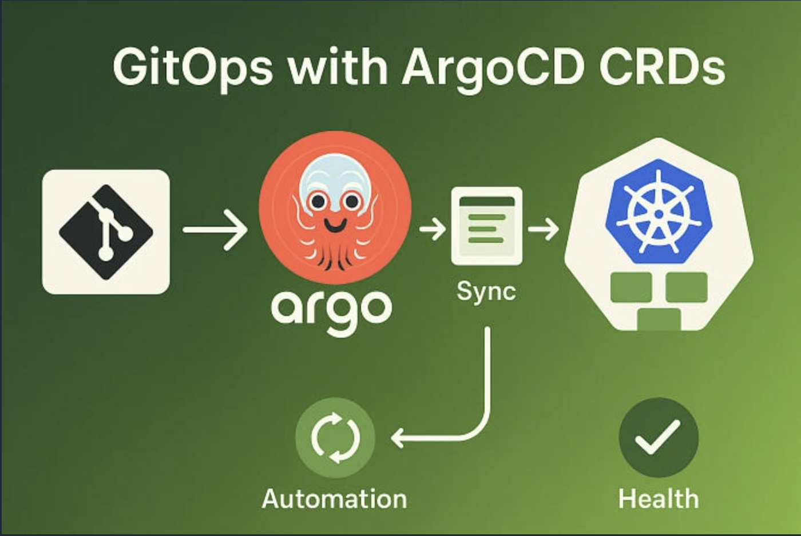
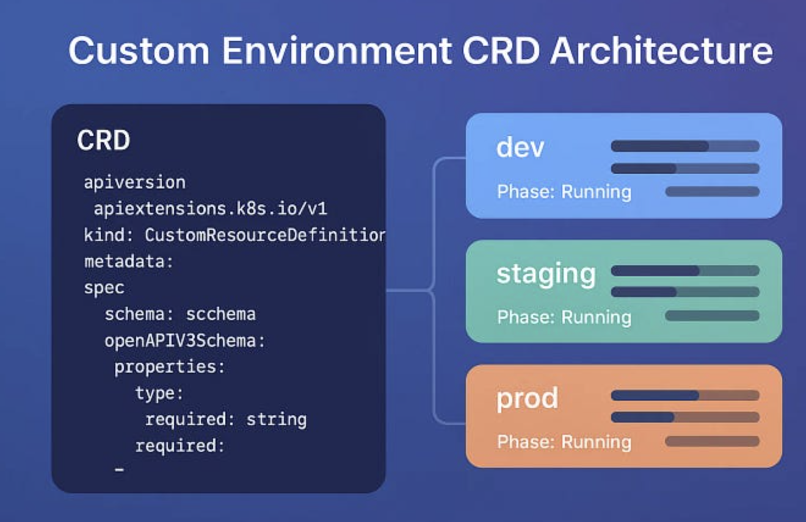

# Hands-on: Installing and Exploring CRDs

## Setting Up Your Environment

First, create a test cluster (using any provider):

```bash
# Using kind (Kubernetes in Docker)
kind create cluster --name crd-exploration
# Or using k3s
curl -sfL https://get.k3s.io | sh -
# Or use any cloud provider (GKE, EKS, AKS, DigitalOcean)
```

## Installing Tekton CRDs

Tekton provides building blocks for CI/CD systems with custom resources for pipelines, tasks, and runs.

```bash
# Install Tekton Pipelines
kubectl apply --filename https://storage.googleapis.com/tekton-releases/pipeline/latest/release.yaml
# Watch the installation
kubectl get pods --namespace tekton-pipelines --watch
# Expected output:
# NAME                                           READY   STATUS    RESTARTS   AGE
# tekton-pipelines-controller-7d8c6c8d4f-xyz    1/1     Running   0          30s
# tekton-pipelines-webhook-68b8c5f7b9-abc       1/1     Running   0          30s
```

Let's explore what CRDs were installed:

```bash
# List all CRDs
kubectl get crd

# Filter for Tekton CRDs
kubectl get crd | grep tekton
# Sample output:
customruns.tekton.dev                                           2026-03-17T17:10:48Z
pipelineruns.tekton.dev                                         2026-03-17T17:10:48Z
pipelines.tekton.dev                                            2026-03-17T17:10:48Z
resolutionrequests.resolution.tekton.dev                        2026-03-17T17:10:48Z
stepactions.tekton.dev                                          2026-03-17T17:10:48Z
taskruns.tekton.dev                                             2026-03-17T17:10:49Z
tasks.tekton.dev                                                2026-03-17T17:10:49Z
verificationpolicies.tekton.dev                                 2026-03-17T17:10:49Z
```

## Understanding What Was Installed

Let's examine a specific CRD to understand its structure:

```bash
# Describe a Pipeline CRD
kubectl describe crd pipeline.tekton.dev

# Get the YAML definition
kubectl get crd pipelines.tekton.dev -o yaml > pipeline-crd.yaml
```

Key sections in a CRD definition:

- **metadata:** Name and labels.
- **spec.group:** API group (tekton.dev)
- **spec.versions:** Supported versions
- **spec.names:** Resource names (plural, singular, kind)
- **spec.scope:** Namespaced or Cluster-wide
- 


-----

## Real-World Examples: Production-Grade CRDs

Let's explore how different projects use CRDs to extend Kubernetes functionality

### Example 1: Tekton Pipelines

Tekton revolutionizes CI/CD by making pipelines themselves Kubernetes resources.



### Example 2: Longhorn Storage System

Longhorn provides distributed storage by creating custom resources for storage management.

```bash
# Install Longhorn
kubectl apply -f https://raw.githubusercontent.com/longhorn/longhorn/master/deploy/longhorn.yaml
# Wait for installation
kubectl get pods -n longhorn-system --watch
```

**Explore Longhorn CRDs:**

```bash
# List Longhorn-specific resources
kubectl api-resources | grep longhorn
```

### Example 3: ArgoCD Application Management

ArgoCD uses CRDs to manage GitOps workflows:



--------

## Creating Your Own CRDs

Now let's create a custom CRD for a real-world scenario: managing application environments.

### Scenario: Environment Management CRD

Imagine you need to manage different environments (dev, staging, prod) with specific configurations. Let's create an `Environment` CRD.

#### Step 1: Define the CRD

#### Step 2: Apply the CRD

```bash
# Create the CRD
kubectl apply -f environment-crd.yaml
# Verify it's created
kubectl get crd environments.platform.company.com
# Check if we can create environments now
kubectl api-resources | grep environment
```

#### Step 3: Create Environment Instances



#### Building a Simple Controller