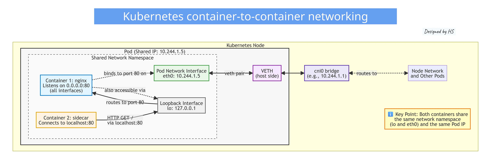
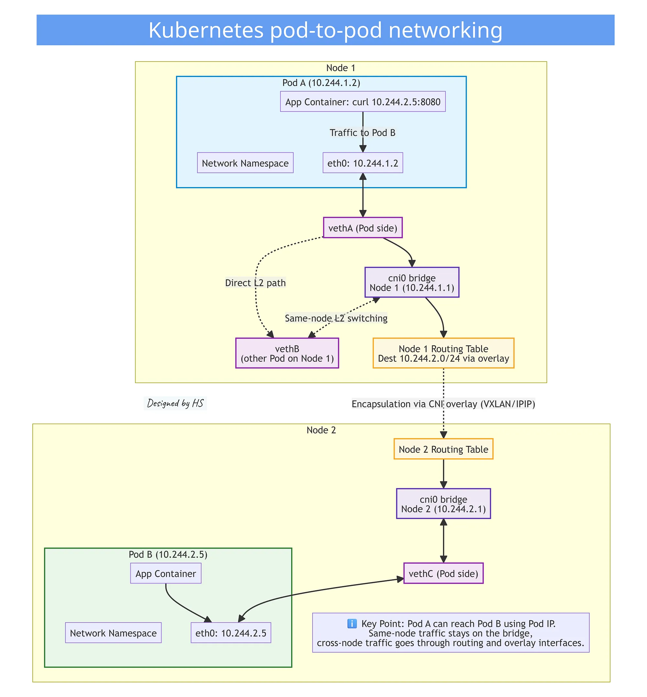
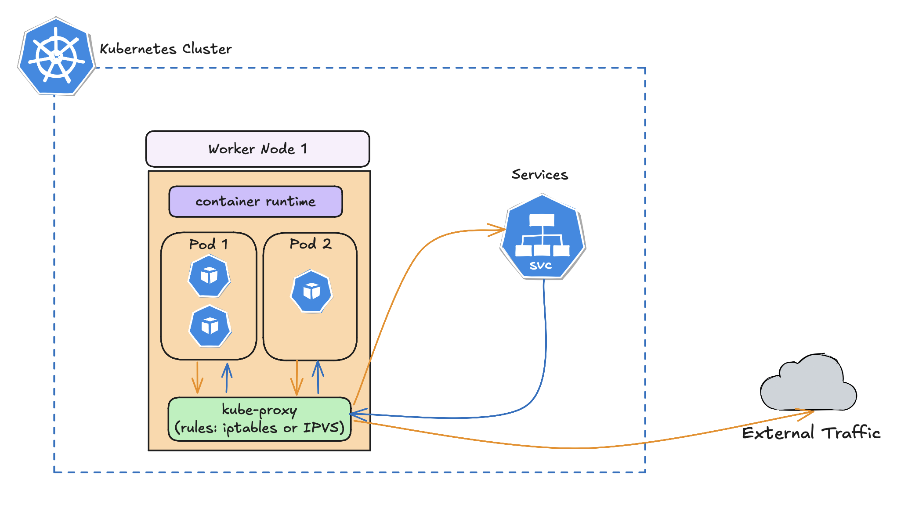

# Kubernetes Networking: A Deep Dive

## 1. Introduction

Kubernetes networking is one of the most misunderstood - and most critical - components of the platform.

### The Kubernetes Networking Model

Kubernetes enforces three foundational networking principles:

**1. Pod-to-Pod Communication:** Every Pod can communicate directly with any other Pod across nodes, without NAT.

**2. Node-to-Pod Communication:** Nodes can reach every Pod, and Pods can reach nodes, also without NAT.

**3. Pod IP Consistency:** A Pod's self-IP is identical to what other Pods see externally.

This creates a flat, routable L3 network in which each Pod is a first-class network entity.

- Applications can communicate using standard IPs; no port translation is needed.
- Simplifies microservices communication.
- Enables network policies to be applied at the Pod level.

## 2. The Five Types of Kubernetes Networking

Kubernetes networking addresses five concerns:

1. Container-to-Container Networking.
2. Pod-to-Pod Networking.
3. Pod-to-Service Networking.
4. External/Internetet-to-Service Networking (Ingress).
5. Pod-to-External Networking (Egress).

## 3. Communication Type: Container-to-Container (Inside a Pod)

- **Shared Network Namespace:** Containers within the same pod share the same network namespace, meaning they can communicate with each other via `localhost` and share the same IP adress and port space.

- **Inter-Process Communication (IPC):** Containers in a pod can use standard IPC mechanisms like SystemV semaphores or POSIX shared memory to communicate.

- **Shared Volumes:** Containers in the same pod can also communicate by reading and writing to shared volumes.

```yaml
kubernetes_node:
  name: "node-1"
  components:
    pod:
      name: "example-pod"
      ip: "10.244.1.5"
      network_namespace:
        interfaces:
          loopback:
            name: "lo"
            ip: "127.0.0.1"
            purpose: "Container-to-container localhost communication"
          ethernet:
            name: "eth0"
            ip: "10.244.1.5"
            purpose: "Pod network interface for all external communication"
        containers:
          - name: "container-1"
            role: "application"
            image: "nginx"
            listens_on:
              interface: "lo"
              port: 80
          - name: "container-2"
            role: "sidecar"
            action: "curl localhost:80"
            connects_to:
              target: "container-1"
              via: "127.0.0.1"
              protocol: "HTTP"
              description: "Sends GET / requests over the loopback interface"
```

The BusyBox sidecar continuously sends traffic to the Nginx container using `localhost:80`.



### Terminology explanation

Inside every Kubernetes Pod, and on the host node, you will find several key network interfaces. Each one has a specific purpose in how Pods communicate internally and externally.

**1. Loopback Interface (`lo`)**

The loopback interface is a virtual network interface inside the Pod.

- Allows containers inside the Pod to communicate using `localhost` (127.0.0.1).
- Used for container-to-container communication within the same Pod.
- Exists in _every_ Linux network namespace.

> 📌 Anything listening on `127.0.0.1` inside a Pod is accessible only to containers in that same Pod.

**2. Pod Interface (`eth0`)**

The main network interface inside the Pod. Every Pod gets one IP address, and that IP is assigned to its `eth0` interface.

- Sends/receives traffic between Pods.
- Communicates with Services, DNS, and external networks.
- Source IP for all traffic leaving the Pod.

> 📌 `eth0` holds the Pod IP (e.g., 10.244.1.5).

**3. VETH Pair (Virtual Ethernet Pair)**

A veth pair is like a virtual cable with two ends:

- One end stays inside the Pod.
- One end stays on the host (node).

> 📌 It is used to connect the Pod’s network namespace to the host networking system.

Kubernetes CNIs (Calico, Flannel, Cilium, etc.) rely on veth pairs to plug Pods into the cluster network.

**4. VETH_P - Pod-Side VETH Interface**

The Pod-side end of a veth pair:

- Connects the Pod to the host.
- Passes traffic from the Pod to the host networking stack.
- Usually named something like `eth0@if123` or similar internally.

> 📌 Inside the Pod, traffic exits via `eth0`, but this physically maps to the Pod-side veth interface.

**5. VETH_H — Host-Side VETH Interface**

The host/node side of the veth pair.

- Bridges the Pod's traffic to the CNI plugin (e.g., cni0 bridge)
- Participates in the node's routing and CNI overlays.
- Connects Pods to each other across nodes.

> 📌 This is where the Pod attaches to the node network. Its traffic then goes to the CNI bridge (`cni0` or `flannel.1`, etc.) depending on your CNI.

### Summary

| Component         | Location   | Purpose                                   | Example                |
| ----------------- | ---------- | ----------------------------------------- | ---------------------- |
| **lo (loopback)** | Inside Pod | localhost connectivity between containers | 127.0.0.1              |
| **eth0**          | Inside Pod | Pod’s main network interface              | 10.244.1.5             |
| **VETH_P**        | Pod        | Pod-side end of veth pair                 | Connects to host       |
| **VETH_H**        | Host       | Host-side end of veth pair                | Connects to CNI bridge |


```text
Container(s) inside Pod
   |
   |  localhost ↔ lo (127.0.0.1)
   |
   |  external traffic ↔ eth0 (Pod IP)
                     ↕
                VETH_P (Pod end)
                     ↕
                VETH_H (Host end)
                     ↕
                  cni0 (bridge)
```

## References:

1. [Kubernetes Networking a Deep Dive](https://medium.com/@h.stoychev87/kubernetes-networking-a-deep-dive-6081d794e97c)

## 4. Communication Type: Pod-to-Pod

### IP-Per-Pod Model

Each pod in Kubernetes is assigned a unique IP address, allowing direct communication between pods without the need for _Network Address Translation (NAT)_. This simplifies networking and ensures that pods can easily find and talk to each other across the cluster.



### Kube-proxy

This component runs on each node and manages network rules to allow communication between pods. It handles routing and load balancing for services within the cluster.

- Watches the Kubernetes API server for changes to Services and Endpoints.
- Updates network rules (iptables, IPVS, or nftables) on each node to route traffic correctly.
- Load balances traffic across the pods backing a Service.
- Maintains the virtual IP (ClusterIP) routing so traffic to a Service IP reaches the right pods.



When you create a Service, kube-proxy ensures that traffic sent to the Service's ClusterIP gets forwarded to one of the healthy pod IPs behind it. It doesn't actually proxy the traffic itself in most modes - it sets up rules so the kernel handles the routing directly.

**Three modes:**

1. iptables mode (most common, still widely used) - Uses iptables rules for routing
2. IPVS mode - Use IPVS for better performance with many Services.
3. userspace mode (legacy) - Actually proxies connections in userspace.

### Terminology explanation

**1. cni0 Bridge**

The A `cniO` brigde is a virtual network brigde on the host node.

- Acts like a virtual switch connecting all Pods on the same node.
- Receives traffic from the host-side veth interface (`VETH_H`) of each Pod.
- Allows same-node Pod-to-Pod communication at Layer 2 (no routing needed).
- Connects to the node routing system for cross-node traffic.

> 📌 Think of it as the local hub where Pods “plug in” to communicate with each other or reach the node network.

**2. CNI Overlay (VXLAN/IPIP)**

When Pods on different nodes need to talk, traffic leaves the `cniO` brigde and is encapsulated by the CNI overlay:

- VXLAN or IPIP wraps the Pod-to-Pod packet inside a new outer packet.
- Outer IP addresses are the node IPs, inner IP addresses are the Pod IPs.
- Sent over the physical network between nodes.
- Decapsulated on the destination node and delivered to the target Pod via that node's brigde.

> 📌 This is how Kubernetes achieves a flat, cluster-wide network, making all Pod IPs reachable across nodes.

**3. Routing Table**

Every node has a routing table that decides where packets go:

- Determines whether a Pod IP is local (on the same node) or remote (on another node).
- Local Pod traffic is sent directly via the cni0 brigde.
- Remote Pod traffic is sent to the CNI overlay interface (e.g., `tunl0` or VXLAN).
- Ensures packets are properly encapsulated and routed to the destination node.

> 📌 The routing table is what makes Kubernetes networking transparent to Pods — a Pod only sees a flat IP space, even if its peer is on another node.  

**4. iptables**

The legacy mechanism kube-proxy uses to implement Kubernetes Services.

- Programs a large set of firewall rules in the Linux kernel.
- Uses NAT (masquerading) and DNAT to redirect Service IPs (ClusterIPs) to backend Pod IPs.
- Works by evaluating rules sequentially, which can become slow at scale.
- Handles connection tracking to ensure packets of the same flow always reach the same Pod.
- Used by default in many older Kubernetes setups.

Think of `iptables` as a long chain of "if-this-then-that" traffic rules.
Powerful, but as the cluster grows, the rule list becomes huge — and that slows things down.

**5. IPVS**

A faster, more scalable alternative to iptables for kube-proxy.

- Implements L4 load balancing directly in the Linux kernel.
- Use hashed or round-robin algorithms to distribute traffic across Pods.
- Builds a dedicated load-balancing table instead of long sequential rule lists.
- More efficient for large clusters with many Services and Endpoints.
- Supports health checking and connection persistence.

Think of `IPVS` as a purpose-built, kernel-level load balancer:
Fast lookups, smarter algorithms, and far more efficient than traversing thousands of iptables rules.

### Summary Diagram

```text
Container(s) inside Pod
   |
   |  localhost ↔ lo (127.0.0.1)
   |
   |  external traffic ↔ eth0 (Pod IP)
                     ↕
                VETH_P (Pod-side)
                     ↕
                VETH_H (Host-side)
                     ↕
                  cni0 (bridge)
                     ↕
         Routing Table + Overlay (VXLAN/IPIP)
                     ↕
          Node Network → other nodes → remote Pod
```