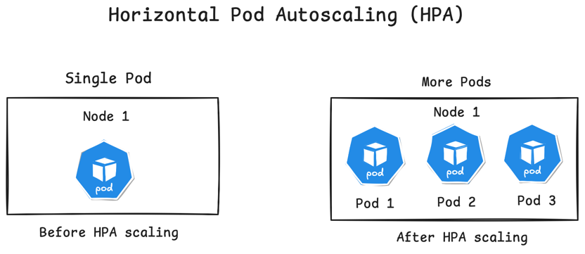
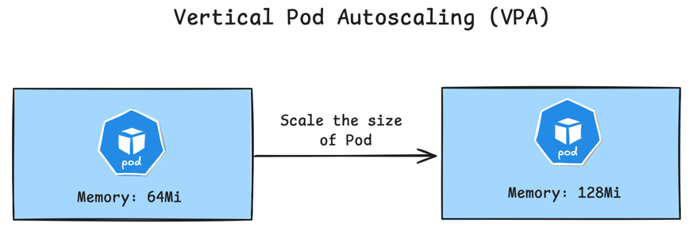
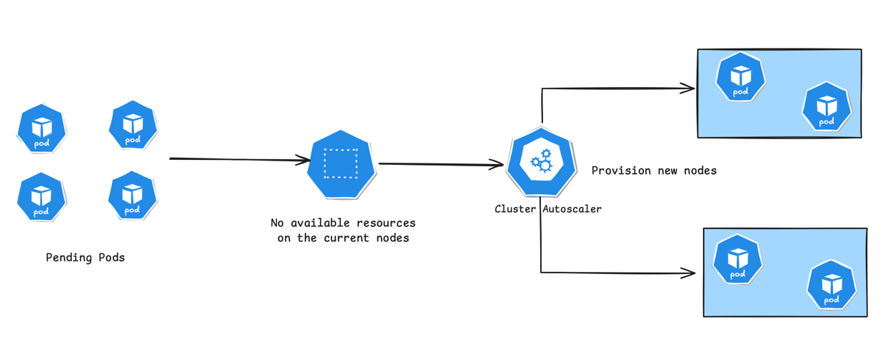

# KUBERNETES SCALING: HORIZONTAL, VERTICAL & CLUSTER

## What is Kubernetes Scaling

Scalability, in general, refers to a system's ability to scale when external conditions change. A scalable system is better
able to meet performance requirements consistently because its capacity can be resized based on factors such as resource
utilization, error rates, and active user counts.

> **Kubernetes scaling** refers to the process of dynamically adjusting the number of pods replicas (instances of your application)
> in a Kubernetes cluster to meet varying demands. Depending on the use case, this can be done either manually of automatically.
> Scaling ensures your application can handle increased load or save resources during low-demand periods.

Systems that are easy to expand with additional resources are more scalable than those that operate in a fixed environment.

Kubernetes has good scalability because it uses a distributed architecture, where workloads are divided among multiple Nodes
that you can freely add and remove; furthermore, individual workload deployments can be scaled with multiple replicas to increase service
capacity and maximize failure resilience.

## Types of Kubernetes scalability

Kubernetes can be scaled at either the workload or cluster level:

- **Workload scaling** deploys additional Pod replicas or assigns more resources to existing replicas.
- **Cluster scaling** expands overall cluster capacity by adding or resizing Nodes, allowing you to scale your workloads limitlessly.

More generally, Kubernetes scalability has two main forms:

- **Horizontal scaling** expands capacity by adding extra instances to your system, such as starting new Kubernetes Nodes or deployment replicas.
- **Vertical scaling** refers to resizing existing resources, such as by adding extra CPU or memory resource to existing Nodes, or allowing
individual replicase

## Setting up Kubernetes auto-scaling with different scaling options

### 1. Using Kubernetes Horizontal Pod Autoscaler (HPA) for horizontal scaling
 
Horizontal Pod Autoscaler (HPA) automatically modifies the replica count of Kubernetes Deployments and other workloads objects in response to metrics
changes. This allows you to provision additional Pod replicas as utilization evolves. It's ideal for applications in heavy use, but each requests require
few resources to serve.

**Horizontal Pod Autoscaler (HPA)** can scale applications based on various metric sources, including application-specific 
metrics. It integrates with the Kubernetes **Custom Metrics API**, which can be connected to monitoring systems such as 
**Prometheus** through adapters. This allows applications to scale dynamically based on business metrics like incoming orders, 
user registrations, or other critical signals.

By default, HPA relies on the **Kubernetes Metrics Server** to perform scaling based on **CPU and memory usage**. Users define 
target CPU or memory thresholds along with minimum and maximum pod limits, and HPA automatically adjusts the number of 
running pods within these boundaries.

#### Horizontal Pod Autoscaler limitations

HPA works predictably and has few limitations. However, it's worth nothing that you should **avoid basing your HPA configuration
on CPU and memory utilization if you're also using VPA**. Otherwise, the changing CPU and memory requests applied by VPA will
destabilize HPA.

### 2. Using Kubernetes Vertical Pod Autoscaler (VPA) for vertical scaling

Vertical autoscaling is less common in Kubernetes but is possible if you install the optional vertical-pod-autoscaler component
in your cluster. Once enabled, you can use the provided CRDs to set up vertical autoscaling configurations that dynamically change
your workload's CPU and memory resource requests.

Use of VPA isn’t advisable if your app’s resource utilization is predictable and scales linearly with increased usage. 
HPA will be more flexible and resilient in this scenario. Where VPA excels is resizing stateful workloads that may be 
tricky to configure for horizontal scalability. 

VPA lets you ensure stable performance for databases, file servers, and caches by allowing them to access additional 
resources when required, without changing the number of Pods that run.

#### Vertical Pod Autoscaler limitations

Vertical autoscaling has an **important limitation**: When VPA wants to change a Pod’s resource request, it must terminate 
and recreate it. This could cause disruption, so you should utilize Pod Disruption Budgets to control the number of Pods 
that may become unavailable. 

### 3. Using Kubernetes Cluster Autoscaler

Kubernetes cluster autoscaling allows you to dynamically scale the Nodes that host your cluster's workloads. It supports
both horizontal autoscaling - changing the number of Nodes - and vertical autoscaling, where existing Nodes are resized.

Cluster autoscaling is only possible when you’re **operating your cluster in the cloud**. Support is provided by the **Cluster 
Autoscaler component**. This should be preinstalled in your cluster if you’re using a compatible service. All major managed 
Kubernetes platforms provide an autoscaling integration.

Cluster autoscaling responds to two main events:

- When Pods are unschedulable due to unfulfillable Node resource requirements, cluster autoscaling will add new Nodes or resize
existing ones.
- When your cluster has Nodes with no workloads, or Pod eviction onto other Nodes is possible, then excess Nodes will be 
automatically removed.

Cluster Autoscaler removes the capacity limitations of HPA and VPA by automatically adding, removing, or resizing Nodes 
as cluster resource demand changes. This allows workloads to continue scaling even when the cluster reaches its initial resource limits.

In addition to improving scalability, Cluster Autoscaler helps optimize costs by downsizing or removing underutilized Nodes 
when demand decreases. It is typically enabled and managed through the cloud provider’s native tooling and can be configured 
declaratively using Infrastructure as Code tools such as Terraform or Ansible.

When combined with **HPA or VPA**, Cluster Autoscaler provides strong scalability and high availability for production workloads. 
However, all Pods must define accurate resource requests to ensure the autoscaler can correctly evaluate Node utilization 
and make effective scaling decisions.

#### Cluster Autoscaler limitations

Kubernetes Cluster Autoscaler dynamically adjusts the number of nodes in a cluster based on resource needs, but it has limitations, 
such as reliance on accurate resource requests/limits and inability to scale down underutilized nodes with non-evictable pods 
(e.g., DaemonSets or pods with local storage). Additionally, it does not consider custom metrics for scaling and can face delays 
due to cloud provider API rate limits or cluster-specific configurations.

## Best practices for scaling Kubernetes

- **Use Horizontal/Vertical Pod Autoscaler to scale your workloads:** Setting up HPA and VPA allows for hands-off auto-scaling, 
making your clusters more resilient to unforeseen workload utilization changes.
- **Enable cluster auto-scaling:** Utilizing cluster auto-scaling allows you to scale your clusters almost infinitely, 
ensuring your service remains available even during times of exceptional user demand.
- **Ensure spare cluster capacity is available if not using auto-scaling:** When you’re not using cluster auto-scaling, 
it’s important to ensure your cluster has sufficient spare Node capacity to accommodate scaling changes made to your 
deployments — otherwise, Pods will start to fail scheduling.
- **Set appropriate resource requests and limits on all workloads:** Correct auto-scaling behavior depends on your Pods 
being assigned suitable resource requests and limits. Missing requests prevent the autoscaler from accurately analyzing Node capacity.
- **Keep resource requests and limits closely matched:** Keeping resource requests and limits matched makes scaling behavior 
more predictable. In general, a Pod’s memory limit should always be set equal to its request, ensuring the Pod is reliably 
terminated when memory pressures occur, while the CPU limit may match the request or be left unset.
- **Assign each workload to the most appropriate Node type:** Many cluster admins provision multiple types of Nodes using 
different hardware tiers, such as standard Nodes for regular apps and high-powered GPU-equipped Nodes for more demanding 
workloads. Use affinity rules and label selectors to precisely allocate Pods to Nodes, ensuring efficient resource usage. 
This will prevent autoscaling from scheduling low-priority Pods onto high-end hardware.
- **Utilize Pod Disruption Budgets so users aren’t affected by scaling changes:** Pod Disruption Budgets limit the number 
of Pod replicas that can be simultaneously unavailable during a disruption event, such as scaling down or deploying a new 
version of your app. Configuring PDBs further improves your workload’s resilience by ensuring a minimum availability 
standard is continually maintained.
- **Ensure the correct rollout strategy is used for each Deployment:** Your Deployment’s rollout strategy affects scalability 
and high availability. For example, using the Recreate strategy, where Pods are terminated before they’re replaced, 
can increase the likelihood of disruption, whereas external tools like Argo Rollouts improve safety at scale by allowing 
you to use advanced canary and blue-green deployment methods.