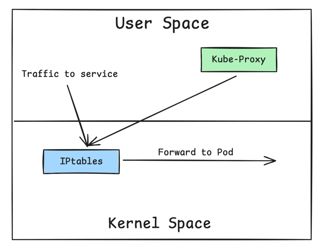

# Kube-Proxy

## Introduction

Networking is a fundamental aspect of Kubernetes, and understanding its components is essential for designing reliable
applications. Kube-proxy is core component that operates behind the scenes, translating Kubernetes Services into concrete 
networking rules on each node. 

## What is Kube-Proxy?

Kube-Proxy is a Kubernetes agent installed on **every node** in the cluster. It monitors the changes that happen to Service
objects and their endpoints. Then it translates these changes into actual network rules inside the node.

Kube-Proxy usually runs in your cluster in the form of DaemonSet. But it can also be installed directly as a Linux process
on the node. This depends on your cluster installation type.

## How Kube-Proxy Works

After Kube-proxy is installed, it authenticates with the API server. When new Services or endpoints are added or removed, 
the API server communicates these changes to the Kube-Proxy.

Kube-Proxy then applies these changes as **NAT** rules inside the node. These NAT rules are simply mapping from Service IP
to Pod IP. When traffic is sent to a Service, it is directed to a backend Pod based on these rules.

Assume we have a Service **SVCO1** of type ClusterIP. When this Service is created, the API server will check which Pods to be
associated with this Service. So, it will look for Pods with **labels** that match the Service's **label selector**.

## Kube-Proxy modes

Kube-Proxy can operate in different modes. Each mode decides how Kube-Proxy implements the NAT rules, with each mode having
its pros and cons.

### IPtables mode

This is the default and most widely used mode today. In this mode Kube-Proxy relies on a Linux feature called **IPtables**.
IPtables works as an internal packet processing and filtering component. It inspects incoming and outgoing traffic to the
Linux machine. Then it applies specific rules against packets that match specific criteria.

When running in this mode, Kube-proxy inserts the Service-to-Pod NAT rules in the IPtables. By doing this, traffic is redirected
to the respective backend Pods after the destination IP is **NATed** from the Service IP to the Pod IP.

The downside of this mode is that IPtables uses a sequential approach going through its tables. Because it was originally
designed as a package filtering component. IPtables doesn't support load balancing algorithms. It uses a random equal-cost
way of distribution.

### IPVS mode

IPVS is a Linux feature designed specifically for load balancing. This makes it a perfect choice for Kube-Proxy to use.
In this mode, Kube-Proxy inserts rules into IPVS instead of IPtables.

IPVS has an optimized lookup algorithm with complexity of O(1). Which means that regardless of how many rules are inserted,
it provides almost a consistent performance.

IPVS also supports different load balancing algorithms like round-robin, least connections, and other hashing approaches.

### KernelSpace mode

This mode is specific to Windows nodes. In this mode Kube-proxy uses Windows **Virtual Filtering Platform (VFP)** to insert 
the packet filtering rules. The **VFP** on Windows works the same as IPtables on Linux, which means that these rules will 
also be responsible for rewriting the packet encapsulation and replacing the destination IP address with the IP of the backend Pod.