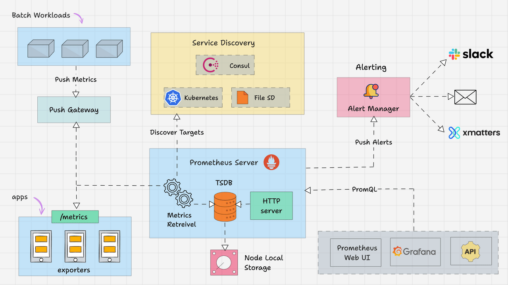
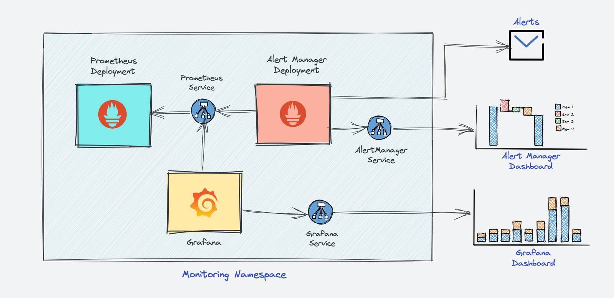
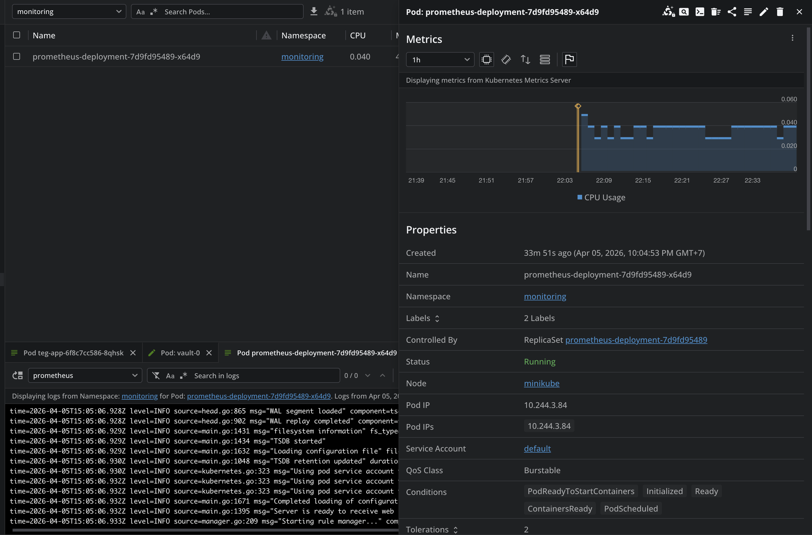
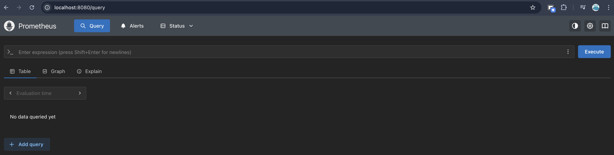
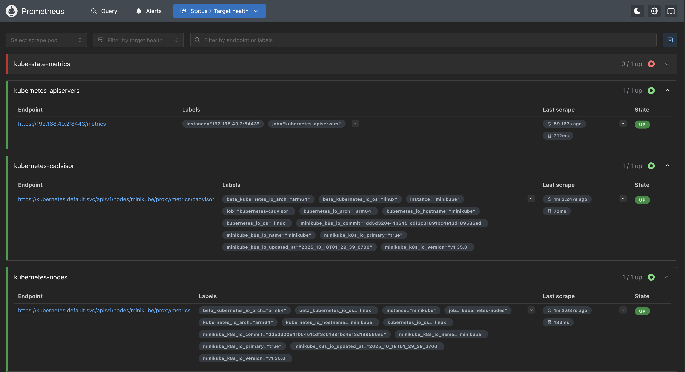
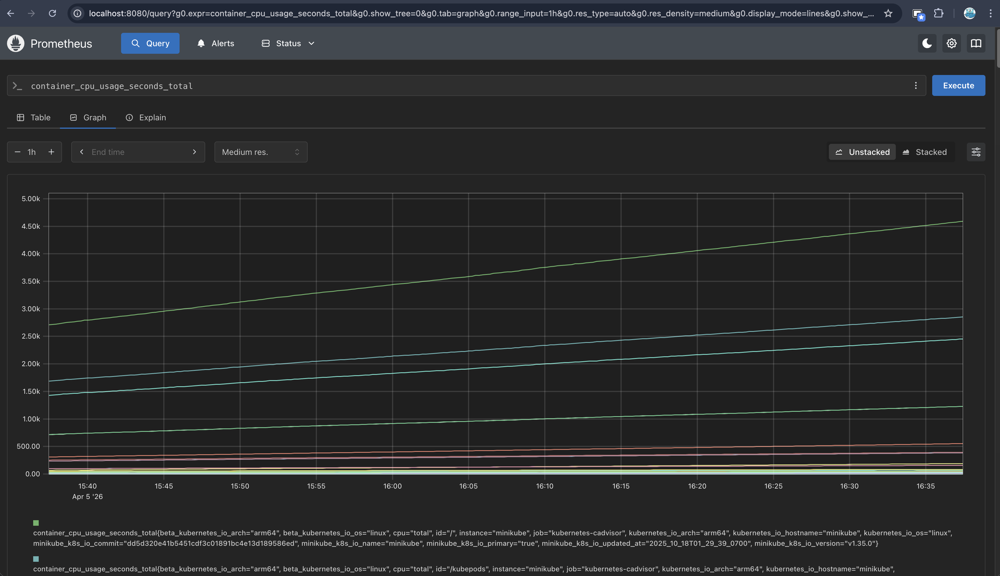

# How to Setup Prometheus Monitoring On Kubernetes Cluster

## Prometheus Architecture

The high-level **architecture of Prometheus**



The Kubernetes Prometheus monitoring stack has the following components:
1. Prometheus Server
2. Alert Manager
3. Grafana

The high-level Prometheus kubernetes architecture



## Create a Deployment Prometheus



## Connecting To Prometheus Dashboard

### Method 1: Using Kubectl port forwarding

**Step 1:** First, get the Prometheus pod name.

```bash
kubectl get pods --namespace=monitoring

# Output
NAME                                     READY   STATUS    RESTARTS   AGE
prometheus-deployment-7d9fd95489-x64d9   1/1     Running   0          88s
```

**Step 2:** Execute the following command with your pod name to access Prometheus from localhost port 8080.

```
kubectl port-forward prometheus-deployment-7d9fd95489-x64d9 8080:9090 -n monitoring
```

**Step 3:** Now, if you access `http://localhost:8080` on your browser, you will get the Prometheus home page.



### Method 2: Exposing Prometheus as a Service [NodePort & LoadBalancer]

**Step 1:** Create a file named `prometheus-service.yaml` and copy the following contents. We will expose Prometheus on all kubernetes node IP's on port `30000`.

The `annotations` in the above service `YAML` makes sure that the service endpoint is scrapped by Prometheus. The `prometheus.io/port` should always be the target port mentioned in service YAML

**Step 2:** Create the service using the following command.

```bash
kubectl create -f prometheus-service.yaml --namespace=monitoring
```

**Step 3:** Once created, you can access the Prometheus dashboard using any of the Kubernetes node's IP on port `30000`. If you are on the cloud, make sure you have the right firewall rules to access port `30000` from your workstation.

**Step 4:** Now, if you browse to `status --> Targets`, you will see all the Kubernetes endpoints connected to Prometheus automatically using service discovery as shown below.



**Step 5:** You can head over to the homepage and select the metrics you need from the drop-down, and get the graph for the time range you mention. An example graph for `container_cpu_usage_seconds_total` is shown below.



### Method 3: Exposing Prometheus Using Ingress


## Reference:
1. https://devopscube.com/setup-prometheus-monitoring-on-kubernetes/#connecting-to-prometheus-dashboard