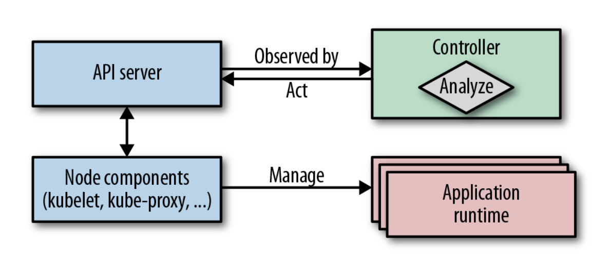

# CONTROLLER

A Controller actively monitors and maintains a set of Kubernetes resources in a desired state. The heart of Kubernetes itself consists of a fleet of controllers
that regularly watch and reconcile the current state of applications with the declared target state.

## Problem

Kubernetes is a powerful but general-purpose orchestration platform, so it doesn't cover every application-specific use case
out of the box. It is built around a declarative, resource-centric API, where users describe the desired target state (for example,
the number of replicas) instead of issuing imperative commands to create manage resources.

Internally, **controllers** watch for changes to resources, react to events, and continuously **reconcile** the current state with the desired state by creating, updating, or deleting resources. This reconciliation loop effectively makes Kubernetes a **   ** that
maintains the declared state over time. Thanks to this architecture, Kubernetes can be extended safely by adding custom controllers that hook
into the reconciliation process without changing or breaking the core Kubernetes system.

## Solution

Kubernetes includes built-in controllers that manage core resources such as ReplicaSets, Deployments, StatefulSets, DaemonSets, and Services.
These controllers run inside the Controller Manager on the control plane and independently execute continuous reconciliation loops
to ensure the actual cluster state matches the desired state.

Thanks to Kubernetes' event-driven architecture, developers can also add **custom controllers** that integrate seamlessly alongside built-in ones without modifying Kubernetes itself. All controllers follow the same pattern: they **observe** resource changes via events, **analyze** differences between actual and desired state, and **act** to reconcile those differences. For example, the ReplicaSet controller monitors ReplicaSet changes and creates or removes Pods as needed to maintain the requested number of replicas.

Controllers are part of Kubernetes’ control plane, and it became clear early on that they would also allow extending the platform with custom behavior. Moreover, they have turned into the standard mechanism for extending the platform and enable
complex application lifecycle management. And as a result, a new generation of more sophisticated controllers was born, called Operators. From an evolutionary and complexity point of view, we can classify the active reconciliation components into two groups:

#### _Controllers:_ 

A simple reconciliation process that monitors and acts on standard Kubernetes resources. More often, these controllers enhance platform behavior and add new platform features.

#### _Operators:_

A sophisticated reconciliation process that interacts with CustomResourceDefinitions (CRDs), which are at the heart of the Operator pattern. Typically, these Operators encapsulate complex application domain logic and manage the full application lifecycle.

The most straightforward kind of controllers extend the way Kubernetes manages its resources. They operate on the same standard resources and perform similar tasks as the Kubernetes internal controllers operating on the standard Kubernetes resources, but which are invisible to the user of the cluster. Controllers evaluate resource definitions and conditionally perform some actions. Although they can monitor and act upon any field in the resource definition, metadata and ConfigMaps are most suitable for this purpose. The following are a few considerations to keep in mind when choosing where to store controller data:

#### _Labels:_

Labels as part of a resource’s metadata can be watched by any controller. They are indexed in the backend database and can be efficiently searched for in queries.

#### _Annotations:_

Annotations are an excellent alternative to labels. They have to be used instead of labels if the values do not conform to the syntax restrictions of label values. Annotations are not indexed, so we use annotations for nonidentifying information not used as keys in controller queries. Preferring annotations over labels for arbitrary metadata also has the advantage that it does not negatively impact the internal Kubernetes performance.

#### _ConfigMaps:_

Sometimes controllers need additional information that does not fit well into labels or annotations. In this case, ConfigMaps can be used to hold the target state definition. These ConfigMaps are then watched and read by the controllers.
However, CRDs are much better suited for designing the custom target state specification and are recommended over plain ConfigMaps. For registering CRDs, however, you need elevated cluster-level permissions. If you don’t have these, ConfigMaps are still the best alternative to CRDs. 

