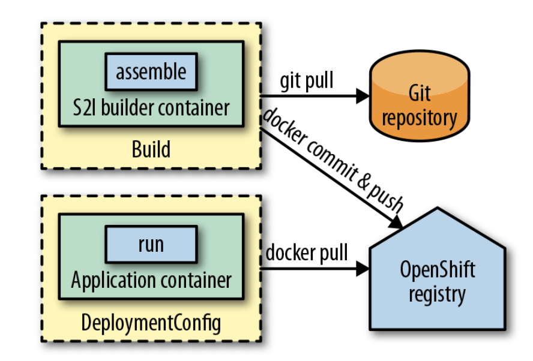

# IMAGE BUILDER

## Problem

Building container images inside a Kubernetes cluster offers several advantages over the traditional approach of building images externally. By using a single cluster for both building and running applications, teams can reduce operational overhead, simplify capacity planning, and lower maintenance costs. Kubernetes' built-in scheduler is well suited for handling CI workloads efficiently. When build and deployment share the same infrastructure, Continuous Delivery becomes smoother, enabling automatic rebuilds and redeployments - for example, when a base image is updated due to a security fix. This approach, known as the Image Builder pattern, tightly integrates image building and deployment, improving automation and responsiveness.

`Building container images inside Kubernetes gives the cluster full control over the build process and improves integration with CI/CD, but it introduces higher security risks because builds no longer run in full isolation. Traditional Docker builds rely on a root-privileged Docker daemon, which is dangerous in Kubernetes since untrusted build steps could escape the container and compromise the host or cluster. To reduce this risk, image builds inside Kubernetes should run without root privileges and without a daemon. Modern daemonless and rootless build tools such as Kaniko, Buildah, img, Jib, and S2I enable secure in-cluster image builds while significantly reducing the attack surface.`

## Solution

### OpenShift Build

OpenShift build was the first cluster-integrated way of directly building images managed by Kubernetes. It supports multiple strategies for building images:

**Source-to-Image (S2I):** Takes the source code of an application and creates the runnable artifact with the help of a language-specific S2I builder image and then pushes the images to the integrated registry.

**Docker Builds:** Use a Dockerfile plus a context directory and creates an images as a Docker daemon would do.

**Pipeline Builds:** Map a build to build jobs of an internally managed Jenkins server by allowing the user to configure a Jenkins pipeline.

**Custom Builds:** Give you full control over how you create your image. Within a custom build, you have to create the image on your own within the build container and push it to a registry.

#### Source-to-Image

An S2I builder image is a standard container image that contains a set of S2I scripts, with two mandatory commands:

**assemble:** The script that gets called when the build starts. Its task is to take the source given by one of the configured inputs, compile it if necessary, and copy the final artifacts to the proper locations.

**run:** Used as an entry point for this image. OpenShift calls this script when it deploys the image. This run script uses the generated artifacts to deliver the application services.

S2I is a robust mechanism for creating application images, and it is more secure than plain Docker builds because the build process is under full control of trusted builder images. However, thisi approach still has some drawbacks.

For complex applications, S2I can be slow, especially when the build needs to load many dependencies. Without any optimization, S2I loads all dependencies afresh for every build. In the case of a Java application built with Maven, there is no caching as when doing local builds. To avoid downloading the internet again and again, it is recommended to set up a cluster internal Maven repository that serves as a cache. The builder image then has to be configured to access this common repository instead of downloading the artifacts from remote repositories.

### Knative Build

The basis of Knative is a service mesh like Istio, which provides infrastructure services for traffic management, observability, and security out of the box. Service meshes use Sidecars to instrument applications with infrastructure-related functionality.

On top of the service mesh, Knative provides additional services, primarily targeted at application developers:

- **Knative serving:** For scale-to-zero support for application services, that can be leveraged by Function-as-a-Service platforms.

- **Knative eventing:** A mechanism for delivering events from sources to sinks through channels. Events can trigger Services used as sinks to scale up from zero.

- **Knative build:** For compiling an application’s source code to container images within a Kubernetes cluster. A follow-up project is Tekton Pipelines, which will eventually replace Knative build.