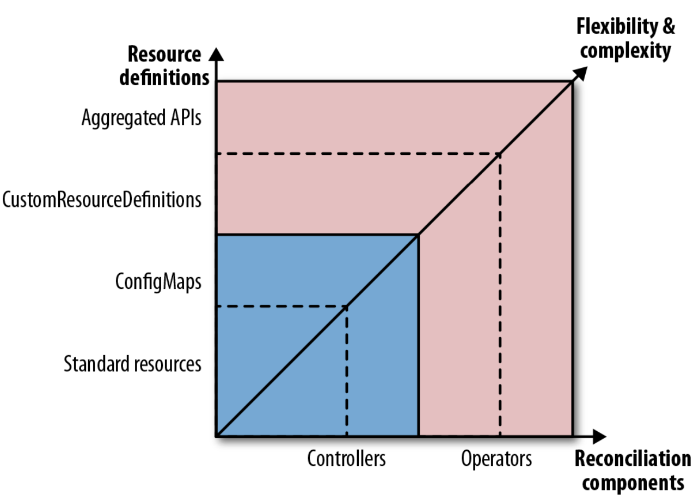

# OPERATOR

An Operator is a Controller that uses a CRD to encapsulate operational knowledge for a specific application in an algorithmic
and automated form. The _Operator_ pattern allows us to extend the Controller pattern for more flexibility and greater expressiveness.

## Problem

Kubernetes can be extended through custom controllers, but plain controllers are limited to managing only built-in Kubernetes
resources. When new domain concepts are needed-such as treating Prometheus or databases as first-class resources - CustomResourceDefinitions (CRDs)
allow the Kubernetes API to be extended with custom resources. An Operator combines (CRDs) with a controller that understands
both Kubernetes and the application domain, enabling automated and consistent management of complex application lifecycles.
In essence, Operators encode human operational knowledge into software, allowing Kubernetes to manage sophisticated systems autonomously.

## Solution

### Custom Resource Definitions

```text
Observe -> Analyze -> Act -> Repeat
```

A **CRD** allows you to extend the Kubernetes API by introducing new resource types that behave like native resources.

```yaml
apiVersion: apiextensions.k8s.io/v1beta1
kind: CustomResourceDefinition
metadata:
 name: prometheuses.monitoring.coreos.com #1
spec:
    group: monitoring.coreos.com #2
    names:
        kind: Prometheus #3
        plural: prometheuses #4
    scope: Namespaced #5
    version: v1 #6
    validation:
        openAPIV3Schema: .... #7
```

- __(1)__ - Name
- __(2)__ - API group it belong to
- __(3)__ - Kind used to identify instances of this resource
- __(4)__ - Naming rule for creating the plural form, used for specifying a list of those objects.
- __(5)__ - Scope - whether the resource can be created cluster-wide or is specific to a namespace.
- __(6)__ - Version of the CRD
- __(7)__ - OpenAPI V3 schema for validation (not shown here)

Kubernetes allows us to specify two possible subresources for our CRD via the spec field subresources:

`status`

- Allows updating status independently from spec.
- Follows the same pattern as native Kubernetes resources.
- Controllers update status; user updates spec. 

`scale`

- Defines path for desired and autual replicas
- Enables `kubectl scale`
- Required for Horizontal Pod Autocaler (HPA) support

### Controller and Operator Classification

Based on the Operator's action, broadly the classifications are as follows:

#### Installations CRDs

Meant for installing and operating applications on the Kubernetes platform. Typical examples are the Prometheus CRDs, which
we can use for installing and managing Prometheus itself.

#### Application CRDs

This kind of CRD allows applications deep integration with Kubernetes, which involves combining Kubernetes with an application-specific domain behavior. For example, the ServiceMonitor CRD is used by the Prometheus operator to register
specific Kubernetes Services for being scraped by a Prometheus server. The Prometheus operator takes care of adapting the Prometheus' server configuration accordingly.



In addition to extending Kubernetes using **CustomResourceDefinitions (CRDs) and Operators**, Kubernetes also provides a more
advanced extension mechanism knows as **API Aggregation**. This approach allows you to register a **custom API server** via an
`APIService` resource, enabling Kubernetes to route requests for a new API group and version to a user-implemented backend service instead of handling them internally.

Unlikes CRDs - where Kubernetes fully manages custom resources and persists them in **etcd** - API aggregation requires the custom API server to implement all responsibilities itself, including request handling, validation, authorization, and data persistance. This offers significantly more flexibility and control, but also introduces substantial implmentation and operational complexity.

In practice, **CRD-based Operators** are sufficient for most use cases, as they integrate natuarally with Kubernetes' event-driven reconciliation model and provide a clean, maintainable way to manage application lifecycles. **API Aggregation** should be reserved for advanced scenarios where CRDs are insufficient to model the domain or when deep control over API behavior is required.

### Operator Development and Deployment

#### Operator Framework

The Operator Framework provides extensive support for developing Golang-based operators. It provides several subcomponents:

- The _Operator SDK_ provides a high-level API for accessing a Kubernetes cluster and a scaffolding to start up an operator object.
- The _Operator Lifecycle Manager_ manages the release and updates of operators and their CRDs.
- _Operator Metering_ enables using reporting for operators.

Operator Lifecycle Manager (OLM) simplifies the installation and management of Kubernete Operators by addressing the permission challenges of CustomResourceDefinitions (CRDs), which require cluster-admin priviledges. OLM runs as a cluster-level service with elevated permissions and introduces the **ClusterServiceVersion (CSV)**, a special CRD
that describes an Operator's deployment, required CRDs, permissions, and versioning. By using CSVs, OLM can install CRDs and deploy Operators on behalf of non-privileged users, enabling safe, standarized, and scalable Operator lifecycle management
in multi-tenant Kubernetes clusters.

#### Kubebuilder

Kuberbuilder is a Kubernetes project developed by the SIG API Machinery that provides strong documentation and tooling for building Go-based Operators. It supports project scaffolding and managing multiple CRDs, working directly with the Kubernetes API for fine-grained control. Compared to the Operator SDK, Kubebuilder offers less abstraction but more flexibility. However,
it does not provide advanced lifecycle management features like OLM, as its primary focus is Operator development rather than
installation and upgrades.

#### Metacontroller

Metacontroller is an alternative approach to building Kubernetes controllers that abstracts away most of the boilerplate involved in writing reconciliation logic. Instead of implementing a full controller, developers define controller behavior declaratively using Metacontroller-specific CRDs and provide a webhook that contains only domain-specific business logic. Metacontroller handles watching resources, running the reconciliation loop, and interacting with the Kubernetes API, then delegates decisions to the webhook via HTTP and JSON. This model allows controllers to be written in any programming language and is well suited for lightweight automation, orchestration patterns, and use cases where rapid development or non-Go implementations are preferred.