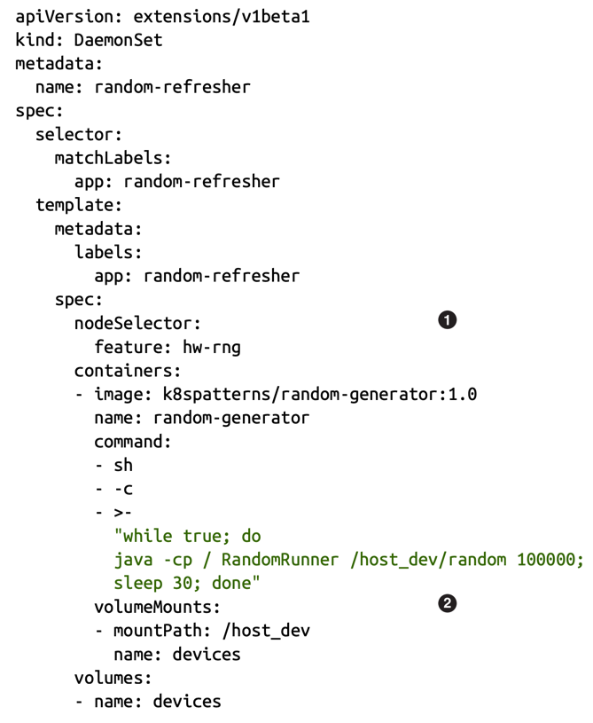

# DAEMON SERVICE

## Problem

A daemon is a long-running background process that operates without direct user interaction. At the OS level (e.g., Unix), daemons
like `httpd` or `sshd` start at boot and provide system-level services. The same concept exists inside applications, such as JVM
daemon threads that run in the background to support main application threads.

Kubernetes applies this idea through **DaemonSets**, which ensure that specifics Pods run on every node (or selected nodes)
in the cluster. These Pods provide cluster-wide background capabilities - such as logging, monitoring, networking agents, or storage
drivers - similar to system daemons supporting an operating system.

## Solution

ReplicaSet and ReplicationController are mechanisms designed to ensure that a fixed number of Pods are always running.
They continuously monitor the running Pods and make sure that the actual number always matches the desired count. For example,
if you want to 5 Pods, these controllers will maintain exactly 5 Pods regardless how many nodes exist in the cluster.

A DaemonSet also ensures that Pods are running, but its purpose and behavior are completely different:

**ReplicaSet/ReplicationController:**

- Determine the number of Pods based on application needs (user load, high availability).
- Do not care about the number of nodes; they only ensure the desired Pod count.

**DaemonSet:**

- Does not depend on load or application demand.
- Its main goal is to ensure that each node (or a selected group of nodes) always runs exactly one Pod.
- Common examples include log collectors, metrics agents, and network plugins - components that need to run on every node.

**(1)** - Use only nodes with the label feature set to value hw-rng.

**(2)** - DaemonSets often mount a portion of a node's filesystem to perform maintenance actions.

There are many differences in how DaemonSet and ReplicaSet are managed, but the main ones are the following:

- By default, a DaemonSet places one Pod instance to every node. That can be controlled and limited to a subset of nodes
by using the nodeSelector field.
- A Pod created by a DaemonSet already has nodeName specified. As a result, the DaemonSet doesn’t require the existence 
of the Kubernetes scheduler to run containers. That also allows using a DaemonSet for running and managing the Kubernetes components.
- Pods created by a DaemonSet can run before the scheduler has started, which allows them to run before any other Pod is placed on a node.
- Since the scheduler is not used, the unschedulable field of a node is not respected by the DaemonSet controller.
- Pods managed by a DaemonSet are supposed to run only on targeted nodes, and as a result, are treated with higher priority and differently by many controllers. 
For example, the descheduler will avoid evicting such Pods, the cluster autoscaler will manage them separately, etc.

Typically a DaemonSet creates a single Pod on every node or subset of nodes. Given that, there are several ways for Pods managed by DaemonSets to be reached:

**_Service:_** Create a Service with the same Pod selector as a DaemonSet, and use the Service to reach a daemon Pod load-balanced to a random node.

**_DNS:_** Create a headless Service with the same Pod selector as a DaemonSet that can be used to retrieve multiple A records from DNS containing all Pod IPs and ports.

**_NodeIP with hostPort:_** Pods in the DaemonSet can specify a hostPort and become reachable via the node IP addresses and the specified port. Since the combination of hostIp and
hostPort and protocol must be unique, the number of places where a Pod can be scheduled is limited.

**_Push:_** The application in the DaemonSets Pod can push data to a well-known location or service that’s external to the Pod. No consumer needs to reach the DaemonSets Pods.