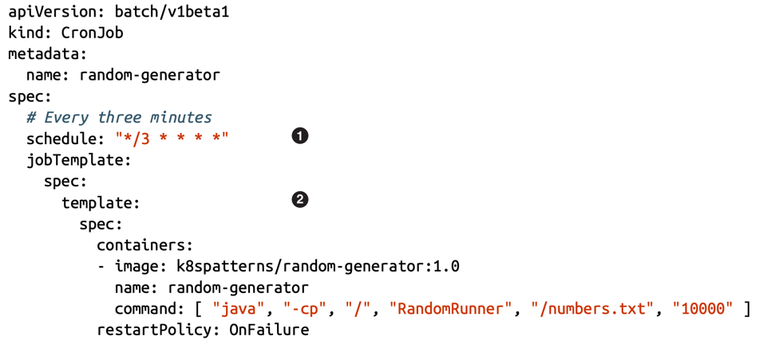

# PERIODIC JOB

## Problem

Traditional approaches to scheduling periodic jobs - such as Cron, custom in-application schedulers, or specialized enterprise
tools - introduce several issues. Cron jobs running on a single server are hard to maintain and become a single point of failure.
Building scheduling logic inside applications requires making the entire application highly available, which leads to running
multiple instances, implementing leader election, and dealing with distributed-system complexity. As a result, even simple periodic
tasks can require unnecessary infrastructure, complexity, and resource consumption.

## Solution

A CronJob instance is similar to one line of a Unix crontab (cron table) and manages the temporal aspects of a Job. It allows
the execution of a Job periodically at a specified point in time.

**(1)** - Cron specification for running every three minutes.
**(2)** - Job template that uses the same specification as a regular Job.

A CronJob has additional fields to define its temporal aspects:

`.spec.schedule`: Crontab entry for specifying the Job's schedule (e.g., 0 * * * * for running every hour).

`.spec.startingDeadlineSeconds`: Deadline (in seconds) for starting the Job if it misses scheduled time. In some use cases, a task is valid 
only if it executed within a certain timeframe and is use-less when executed late. For example, if a Job is not executed in the desired time
because of a lack of compute resources or other missing dependencies, it might be better to skip an execution because the data it is supposed
to process is obsolete already.

`.spec.concurrencyPolicy`: Specifies how to manage concurrent executions of Jobs created by the same CronJob. The default behavior 
Allow creates new Job instances even if the previous Jobs have not completed yet. If that is not the desired behavior, it is possible
to skip the next run if the current one has not completed yet with Forbid or to cancel the currently running Job and start a new one with Replace.

`.spec.suspend`: Field suspending all subsequent executions without affecting already started executions.

`.spec.successfulJobHistoryLimit` and `.spec.failedJobHistoryLimit`: Field specifying how many completed and failed Jobs
should be kept for auditing purposes.

A CronJob is a specialized Kubernetes primitive designed only for workloads that need to run on a time-based schedule. 
Although it isn’t a general-purpose mechanism, it demonstrates how Kubernetes features can be layered to support even 
traditional, non–cloud-native use cases.