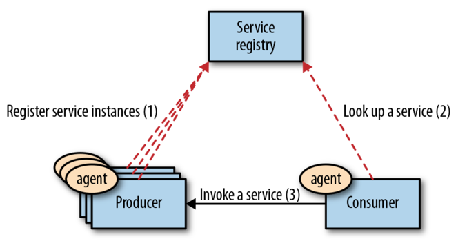
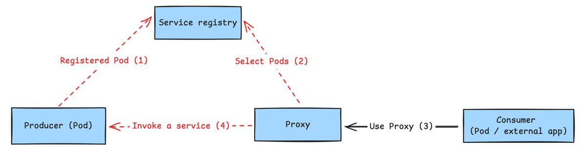
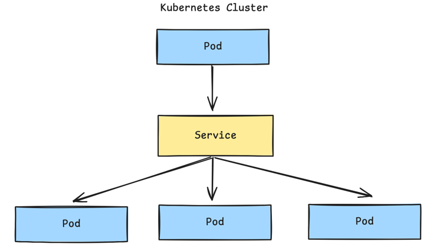
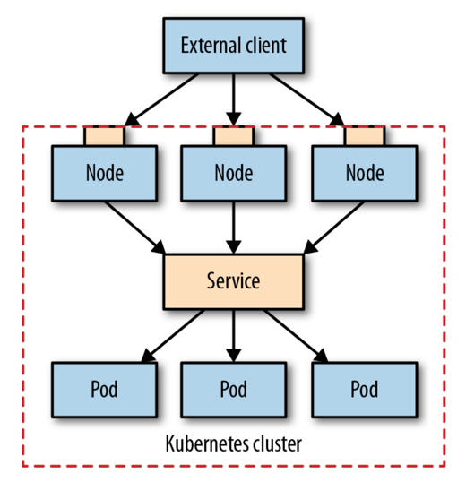

# SERVICE DISCOVERY

## Problem

Applications running on Kubernetes rarely operate in isolation and often need to communicate with other services inside or outside
the cluster. While some workloads actively initiate outgoing connections, many long-running services depend on incoming requests
from dynamic and elastically scaled Pods. Because Pod IPs change frequently and replicas scale up and down, manually tracking service
endpoints would be complex and error-prone. To address this challenge, Kubernetes provides built-in service discovery mechanisms that
enable reliable communication between services.

## Solution

### Client-side discovery

Before Kubernetes, service discovery was typically handled using client-side discovery, where service consumers queried
a registry to find available service instances and chose one to call. This logic was implemented either through embedded
discovery libraries or sidecar processes, which increased application complexity and tightly coupled services to the discovery infrastructure.

### Server-side service discovery

In the post-Kubernetes era, many distributed system responsibilities such as service discovery and load balancing are handled by
the platform instead of the application. Kubernetes allows service consumers to connect to a stable virtual Service endpoint
which dynamically managing the underlying Pods. This abstraction removes the need for client-side discovery logic and simplifies
communication between services both inside and outside the cluster.

### Internal Service Discovery

When applications run with multiple Pods in Kubernetes, Pod IPs are dynamic and cannot be relied on for direct communication.
Kubernetes Service solve this by providing a stable virtual IP and DNS name that routes traffic to matching Pods using label
selectors. Client interacts with the Service endpoint, while Kubernetes handles Pod discovery and load balancing automatically.

#### Discovery through environment variables

When a Kubernetes Service is created, it is assigned a stable virtual IP address called a _ClusterIP_, which is accessible only
from within the cluster and remains unchanged for the lifetime of the Service. To allow Pods to discover this dynamically allocated IP,
Kubernetes provides a service discovery mechanism based on environment variables. As Pod startup time, Kubernetes injects environment
variables containing the host and port information of all existing Services into the Pod. Applications can be implemented to read
these variables using the known Service name, making this approach language-agnostic and easy to use, even in local development environments.

However, this mechanism has an important limitation: environment variables are only populated when the Pod starts. If a Service is created
after a Pod is already running, the Pod will not receive the corresponding Service environment variables. As a result, this approach introduces a 
temporal dependency between Service creation and Pod startup, often requiring Services to be defined before dependent Pods or Pods to be restarted.
Due to this limitation, environment-variable-based discovery is typically suitable for simple or static setups.

#### Discovery through DNS lookup

Kubernetes provides DNS-based Service Discovery through an internal DNS server that all Pods use by default. Each Service
automatically receives a DNS entry, allowing Pods to access it via a stable name instead of dynamic IP address. This mechanism
works immediately for all Pods, regardless of when they were started, unlike environment-variable-based discovery. DNS discovery
is the recommended and most flexible approach for service-to-service communication in Kubernetes.

**ClusterIP** is the default Kubernetes Service type that provides a stable virtual IP for accessing a group of Pods inside the cluster.
It supports multiple ports, simple L4 load balancing, optional session affinity based on client IP, and integrates with readiness probes
to route traffic only the healthy Pods. The ClusterIP is a virtual address implemented via kube-proxy and iptables, not a real network
interface, and is accessible only within the cluster. ClusterIP is the most commonly used Service type for internal service discovery
and communication between microservices.

### Manual Service Discovery

Kubernetes Services typically use selectors to automatically route traffic to ready Pods via dynamically managed Endpoints.
However, a Service can also be created without a selector, allowing Endpoints to be defined manually and point to external IP
addresses or custom backends. This approach enables clients to access both internal and external through a stable ClusterIP
and standard Service discovery mechanisms (DNS or environment variables). It is especially useful for migrating services 
without changing client configurations.

### Service Discovery from Outside the Cluster

While ClusterIP Services are only accessible in the Kubernetes cluster, external clients often need to access service running in Pods.
A Service of type **NodePort** exposes an application outside the cluster by reserving a port every node and forwarding traffic
to the Service's ClusterIP and then to the Pods. This allows external clients to reach the service using `<NodeIP>:<NodePort>`. 
NodePort is simple to use but exposes the service on all nodes and is typically a building block for more advanced exposure methods.

- **Port Number:** Instead of picking a specific port with nodePort: 30036, you can let Kubernetes pick a free port within its range.
- **Firewall rules:**  Since this method opens a port on all the nodes, you may have to configure additional firewall rules to let
external clients access the node ports.
- **Node selection:** An external client can open connection to any node in the cluster. However, if the node is not available,
it is the responsibility of the client application to connect to another healthy node. For this purpose, it may be a good idea to put
a load balancer in front of the nodes that picks healthy nodes and perform failover.
- **Pods selection:** NodePort allows external access to a Service, with traffic routed to a randomly selected Pod. 
Setting `externalTrafficPolicy: Local` ensures traffic only reaches Pods on the same node, but requires either a Pod on 
every node or that the client knows which nodes have healthy Pods.
- **Source addresses:** With a **NodePort Service**, client source IPs are **NATed**, so Pod see the node's IP instead of
the real client IP. Setting externalTrafficPolicy: Local preserves the client IP by routing traffic only to Pods on the same node.
