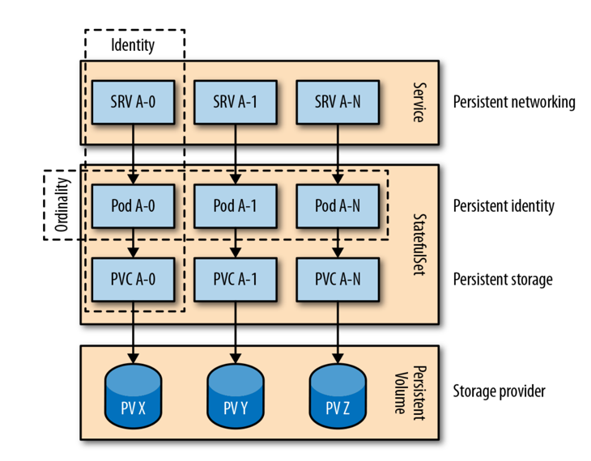

# STATEFUL SERVICE

## Problem

Kubernetes provides many primitives for running **stateless applications**, such as Deployments, ReplicaSets, Jobs and health
checks. These workloads are designed to be disposable, interchangeable, and follow 12-Factor App principles. This works very
well for microservices that do not store long-lived state.

However, real systems also rely heavily on **stateful application** - database, caches, coordination services, and other components
that maintain persistent data. Early versions of Kubernetes did not support stateful workloads well, so teams often ran stateless
applications inside the cluster but kept stateful systems outside of it.

Running stateful applications is much harder because each instance is unique, much keep its identity, and requires stable storage.
Simply using a Deployment with one replica and a PersistentVolume is not enough, since ReplicaSets do not guarantee strict single-instance
behavior and may temporarily create multiple Pods, which can use data corruption.

For clustered stateful applications (e.g., ZooKeeper, MongoDB, Redis), the requirements are even more complex-needing stable
identities, ordered startup, quorum, leader election, and consistent long-term behavior. These needs go beyond what stateless-oriented
Kubernetes primitives can safely provide.

This gap is the core problem that motivated the creation of **StatefulSet** and other Kubernetes mechanisms for stateful workloads.

### Storage

In a ReplicaSet with multiple replicas, all Pods share the same PersistentVolume when using a single PVC. This is unsuitable for distributed
stateful applications, which require **dedicated storage per instance**. Using shared storage introduces risks such as data corruption
and creates a single point of failure. Creating separate ReplicaSets (each with its own PVC and PV) solves the storage isolation issue
but requires heavy manual work and lacks a unified abstraction to manage all instances as one.

### Networking

Distributed stateful applications require a stable network identity for each instance, because they store configuration 
details such as their own hostname and connection information for peer nodes. However, Pods in a ReplicaSet receive dynamic 
Pod IPs, which change whenever the Pod is recreated, making them unreliable for this purpose.

A workaround is to create **one Service per Pod** (using a ReplicaSet with `replicas=1`) to give each instance a stable address, 
but this approach is manual, hard to scale, and not suitable when the number of instances changes dynamically.

This limitation shows that ReplicaSets are not ideal for stateful workloads, and highlights the need for more specialized 
mechanisms like StatefulSet, which provides stable network identities by design.

### Identity

Clustered stateful applications rely on each instance having long-lived storage and a stable network identity. 
This is because every instance is unique and must know its own identity, which includes persistent storage, 
stable network coordinates, and often a **consistent, persistent instance name.**

With a ReplicaSet, Pods get **random names** and do not keep the same identity after a restart. This makes ReplicaSets 
unsuitable for stateful applications that require consistent instance identities.

## Solution

StatefulSet manages stateful applications by giving each Pod a stable identity, stable network hostname, and a dedicated
persistent volume. Pods are named with ordinals (`name-0`, `name-1`), are created/deleted in order, and each gets its own
PVC via volumeClaimTemplates. This makes StatefulSet suitable for database and clustered stateful services where per-instance
identity and persistent storage are required - unlike ReplicaSet, which manages interchangeable stateless Pods.

### Storage

StatefulSets assign a dedicated PersistentVolume to each Pod, ensuring stable, long-lived storage that persists across 
restarts and rescheduling. ReplicaSets do not manage persistent storage; their Pods are ephemeral and typically use 
temporary or shared volumes without any guarantee of data continuity.

### Networking

StatefulSets provide each Pod with a **stable and predictable network identity**, combining the StatefulSet name with 
an ordinal index (e.g., `rg-0`, `rg-1`). To support this, Kubernetes uses a **headless Service** (`clusterIP: None`) that does 
not perform load balancing but instead exposes the real Pod IPs directly.

This headless Service creates DNS A records for every Pod, allowing clients or peer nodes in the cluster to reach each 
instance by its fully qualified domain name (FQDN), such as `rg-0.random-generator.default.svc.cluster.local.` 
This predictable DNS mapping is essential for stateful applications where each Pod is unique and may need to be contacted individually.

The headless Service also maintains Endpoint records and supports SRV lookups, enabling automatic discovery of all 
Pods in the StatefulSet. Importantly, this Service must exist before the StatefulSet is created, as it acts as the 
**governing service** responsible for the network identity of the set. While additional Services (like load-balanced ones) 
can be added later, the governing headless Service is required for correct StatefulSet behavior.