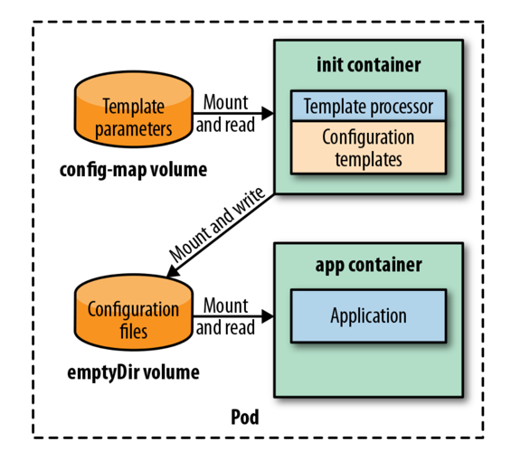

# CONFIGURATION TEMPLATE

The Configuration Template pattern enables creating and processing large and complex configurations during application
startup. The generated configuration is specific to the target runtime environment as reflected by the parameters used
in processing the configuration template.

## Problem

Using ConfigMaps and Secrets for large or complex configuration files can be problematic due to syntax complexity, 
size limits (1 MB), and duplication across environments. Configuration files often differ only slightly between environments, 
leading to redundant and hard-to-maintain ConfigMaps. The Configuration Template pattern addresses these issues by enabling 
reuse of common configuration and minimizing duplication.

## Solution

Configuration Templates reduce duplication by storing only environment-specific values (such as database parameters) in 
ConfigMaps or environment variables instead of full configuration files. During container startup, these values are 
injected into a template to generate the complete configuration file required by the application. This processing can 
be done either in the container ENTRYPOINT or, preferably in Kubernetes, using an Init Container. The Init Container 
approach cleanly separates configuration generation from application logic and works well with Kubernetes-native resources.

This approach uses a Kubernetes Init Container with a template processor (Gomplate) to generate complete application 
configuration files before the main application starts. Configuration templates are stored in the init container image, 
while environment-specific values are provided via a ConfigMap and mounted as a volume. The processed configuration is 
written to a shared emptyDir volume.

Once the init container finishes, the application container starts and reads the generated configuration from the shared volume. 
This pattern avoids configuration duplication, keeps configurations DRY, prevents drift between environments, and allows switching 
environments by changing only the ConfigMap without modifying the Deployment or application image.