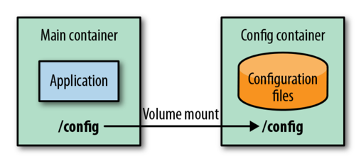
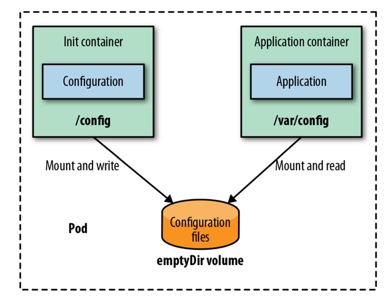

# IMMUTABLE CONFIGURATION

The _Immutable Configuration_ pattern packages configuration data into an immutable container image and links the configuration
container to the application at runtime. With this pattern, we are able to not only use immutable and versioned configuration
data, but also overcome the size limitation of configuration data stored in environment variables or ConfigMaps.

## Problem

Environment variables provide a simple way to configure container-based applications. And although they are easy to use
and universally supported, as soon as the number of environment variables exceeds a certain threshold, managing them becomes hard.

This complexity can be handled to some degree by using _Configuration Resources_. However, all these patterns do not enforce 
_immutability_ of the configuration data itself. Immutability here means that we can't change the configuration after the
application has started, in order to ensure that we always have a well-defined state for our configuration data.

## Solution

This approach packages all environment-specific configuration into a dedicated, passive "data image" that is distributed like
a normal container image. At runtime, the application links to this data image and reads its configuration from it, enabling
immutable, versioned configuration per environment. Creating such images is simple since they only contain data; the main challenge
lies in how the application is linked to the data image at startup, which depends on the platform.

### Docker Volumes

Docker allows a container to expose data through a volume using the `VOLUME` directive in a Dockerfile. When the container
starts, the contents of that directory are copied into a shared volume. This mechanism is an effective way to share configuration
data from a dedicated configuration container to an application container.



#### Example: Dockerfile for a configuration image

```Dockerfile
FROM scratch
ADD app-dev.properties /config/app.properties
VOLUME /config 
```

#### Example: Building the configuration Docker image

Create the image itself and the Docker container with the Docker CLI.

```shell
docker build -t k8spattern/config-dev-image:1.0.1 -f Dockerfile-config
docker create --name config-dev k8spattern/config-dev-image:1.0.1 .
```

#### Example: Start application container with config container linked

The final step is to start the application container and connect it to this configuration container

```shell
docker run --volumes-from config-dev k8spattern/welcome-servlet:1.0
```

The application image expects its configuration files within a directory `/config`, the volume exposed by the configuration
container. When you move this application from the development environment to the production environment, all you have to
do is change the startup command.

#### Example: Use different configuration for production environment

```shell
docker build -t k8spatterns/config-prod-image:1.0.1 -f Dockerfile-config
docker create --name config-prod k8spatterns/config-prod-image:1.0.1 .
docker run --volumes-from config-prod k8spatterns/welcome-servlet:1.0 .
```

### Kubernetes Init Containers

Kubernetes does not support sharing directories directly between containers like Docker's volume linking. Instead, Immutable
Configuration is implemented using **Init Containers**, which prepare a shared volume before the main application starts.
An init container copies configuration data from a configuration image (often based on a lightweight image like BusyBox)
into a empty shared volume, which is then mounted by the application container. This approach enables immutable, versioned
configuration without modifying the application image.

In Kubernetes, immutable configuration can be implemented using Init Containers and shared volumes. An init container 
copies configuration data from a dedicated configuration image into an emptyDir volume during Pod startup. The application 
container then mounts the same volume and reads the configuration without knowing where it came from. This approach keeps 
configuration immutable, versioned as container images, and decoupled from the application image.

