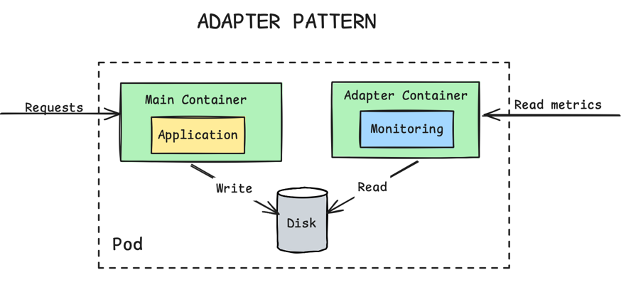

# ADAPTER

The _Adapter_ pattern takes a heterogeneous containerized system and makes it conform to a consistent, unified interface with
a standardized and normalized format that can be consumed by the outside world. The _Adapter_ pattern inherits all its characteristics
from the _Sidecar_, but has the single purpose of providing adapted access to the application.

## Problem

Containers allow us to package and run applications written in different libraries and languages in a unified way. Today,
it is common to see multiple teams using different technologies and creating distributed systems composed of heterogeneous
components. This heterogeneity can cause difficulties when all components have to be treated in a unified way by other systems.
The _Adapter_ pattern offers a solution by hiding the complexity of a system and providing unified access to it.

## Solution

The Adapter pattern enables heterogeneous, containerized applications to expose a unified and standardized interface to
external systems. By running an Adapter as a Sidecar container, application specific data such as logs or metrics can be
transformed into a common format and protocol. This is especially useful for monitoring, where services written in different
languages can expose metrics in a consistent way. As a result, external tools can interact with all services uniformly
without requiring changes to the main application.



```yaml
apiVersion: apps/v1
kind: Deployment
metadata:
  name: random-generator
spec:
  replicas: 1
  selector:
    matchLabels:
      app: random-generator
  template:
    metadata:
      labels:
        app: random-generator
    spec:
      containers:
        - image: k8spatterns/random-generator:1.0 # (1)
          name: random-generator
          env:
            - name: LOG_FILE # (2)
              value: /logs/random.log
          ports:
            - containerPort: 8080
              protocol: TCP
          volumeMounts: # (3)
            - mountPath: /logs
              name: log-volume
    # --------------------------------------------
        - image: k8spatterns/random-generator-exporter # (4)
          name: prometheus-adapter
          env:
            - name: LOG_FILE # (5)
              value: /logs/random.log
          ports:
            - containerPort: 9889
              protocol: TCP
          volumeMounts: # (6)
            - mountPath: /logs
              name: log-volume
      volumes:
        - name: log-volume # (7)
          emptyDir: {}
```

- **(1)**: Main application container with the random generator service exposed on 8080.
- **(2)**: Path to the log file containing the timing information about random-number generation.
- **(3)**: Directory shared with the Prometheus Adapter container.
- **(4)**: Prometheus exporter image, exporting on port 9889
- **(5)**: Path to the same log file to which the main application is logging to.
- **(6)**: Shared volume is also mounted in the Adapter container.
- **(7)**: Files are shared via an emptyDir volume from the node's filesystem.