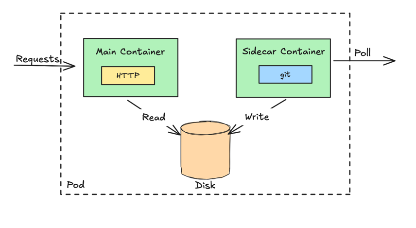

# SIDECAR PATTERN

## Problem:

Containers provide a consistent way to build, ship, and run applications. Each container represents a single, well-defined
unit of functionality with its own runtime, API, and lifecycle, following the principle of doing one thing well. By using
existing, specialized containers, developers can avoid  the wheel and create systems faster and more efficiently.

To extend the functionality of a single-purpose container without changing it, containers can collaborate using the Sidecar
pattern, where an additional container runs alongside the main one to enhance its capabilities, such as handling logging, monitoring,
or networking features.

## Solution:

The Sidecar pattern demonstrates how a helper container, such as a Git synchronizer, can enhance the behavior of a main
container, like an HTTP server, by providing and continually updating the content it serves. Although both containers collaborate
closely, one is designated as the primary container while the other supports it.

This pattern allows containers to work together at runtime while maintaining a clear separation of responsibilities. It also
supports independent development, different technologies, and separate release cycles, enabling greater reusability and
replaceability across applications.

